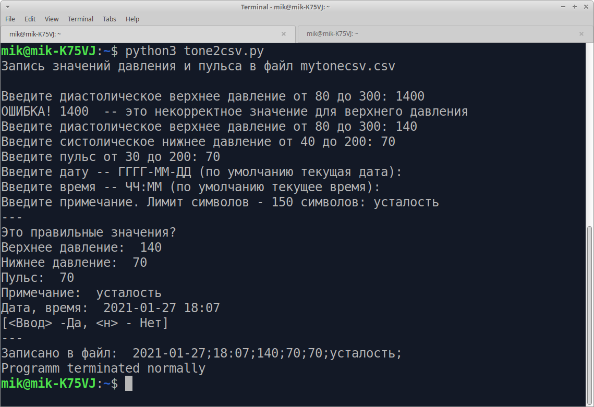

# Автоматизируем ввод данных давления и пульса в CSV

## tone2csv.py

**Python-скрипт для записи значений давления и пульса в файл csv**  
**Python-script for writing blood pressure and pulse values to a csv file**

Для записи ежедневных измерений артеоиального давления в файл формата csv можно использовать и обычный текстовой редактор. Но даный скрипт на Python позволяет автоматизировать этот процесс.

* Ввод данных последовательно в консольном диалоговом режиме
* Значения проверяются на корректность
* Автоматически по умолчанию записывает текущую дату и время

Скрипт может модифицироваться и под любые другие данные в формате csv

## viewtone.py

**Python-скрипт для просмотра значений давления и пульса из файла csv**  
**Python script to view blood pressure and pulse values from csv file**

По умолчанию выводятся десять последних записей

## tone2csv-arg.py

**Python-скрипт для записи значений давления и пульса в файл csv через аргументы командной строки**
**Python script to write pressure and pulse values to csv file via command line arguments**

* Порядок аргументов слкдующий:

    $ python3 tone2csv-arg.py <д> <с> <п> <д> <в> <н>

    д - диастолическое давление
    с - систолическое давление
    п - пульс
    д - дата
    в - время
    н - примечание

* Значения проверяются на корректность
* В случае некорректных данных делается запись в файл ошибок mytone_err.csv
* Дата, время, и примечание могут быть пустыми -- "", тогда втоматически по умолчанию записывает текущую дату и время

    $ tone2csv-arg 120 80 70 '' '' 'г-ка Шишонина'

---
GPL 2021 Астапчик Михаил
