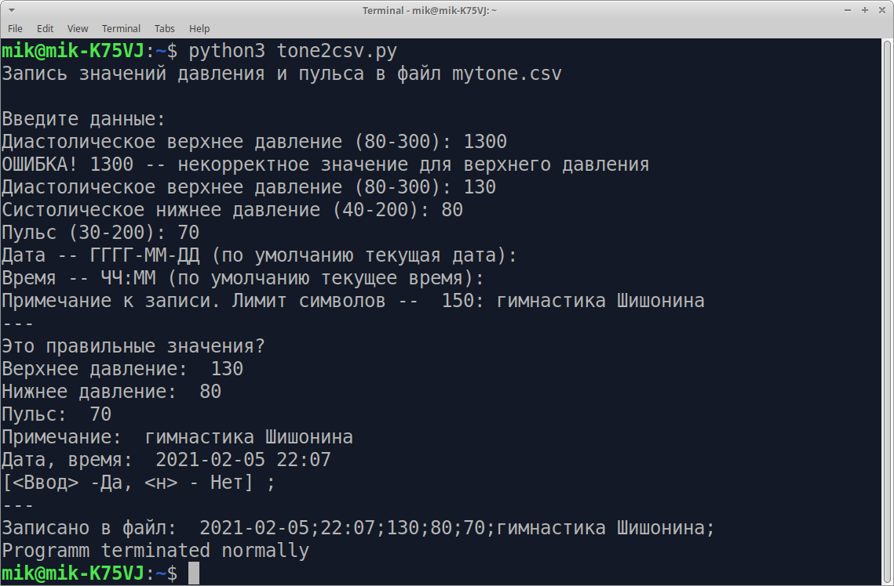

# tone2csv.py

**Python-скрипт для записи значений давления и пульса в файл csv**  
**Python-script for writing blood pressure and pulse values to a csv file**

Для записи ежедневных измерений артеоиального давления в файл формата csv можно использовать и обычный текстовой редактор. Но даный скрипт на Python позволяет автоматизировать этот процесс.

* Ввод данных последовательно в консольном диалоговом режиме
* Значения проверяются на корректность
* Автоматически по умолчанию записывает текущую дату и время

Скрипт может модифицироваться и под любые другие данные в формате csv

## viewtone.py

**Python-скрипт для просмотра значений давления и пульса из файла csv**  
**Python script to view blood pressure and pulse values from csv file**

По умолчанию выводятся десять последних записей

---
GPL 2021
